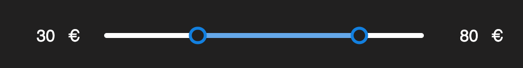
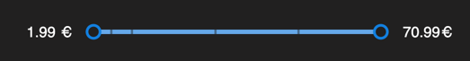

# Range app

This is a range application that explains how to use the range component.  
The range has two ways to be used, normal and with fixed values.  
The default `min`, `max` and `rangeValues` values are mocked in the example.

### [Demo](https://react-range-app.vercel.app/)

## Usage

#### Normal Range

```tsx
<Range min={0} max={100} defaultValue={[30, 80]} unit="€" />
```



#### Fixed values range

```tsx
<Range rangeValues={[1.99, 5.99, 10.99, 30.99, 50.99, 70.99]} unit="€" />
```



## Props

| Name         | Type               | Default value | Description                                                                       |
| ------------ | ------------------ | ------------- | --------------------------------------------------------------------------------- |
| min          | `number`           | `0`           | Defines the minimum value of the component.                                       |
| max          | `number`           | `100`         | Defines the maximum value of the component.                                       |
| unit         | `string`           |               | Defines the units of the component.                                               |
| defaultValue | `[number, number]` | `[0, 100]`    | Defines the default value of the component. Only applies if rangeValues is empty. |
| rangeValues  | `number[]`         |               | Defines the range values of the component. This values only will be selectable.   |

## Development

First, run the development server:

```bash
npm run dev
# or
yarn dev
# or
pnpm dev
```

Open [http://localhost:3000](http://localhost:3000) with your browser to see the result.
